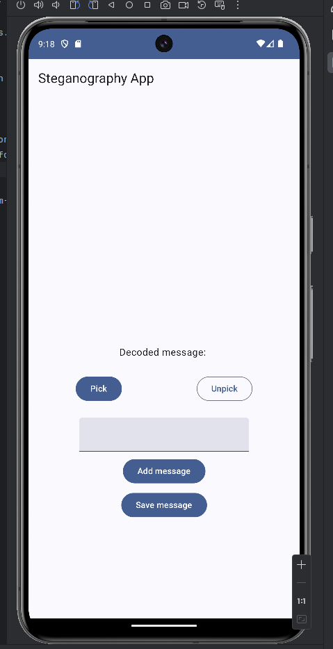
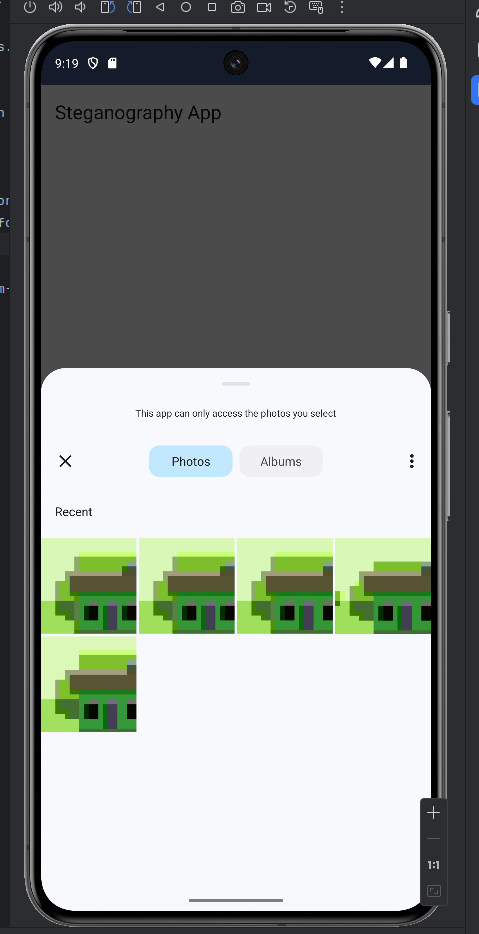
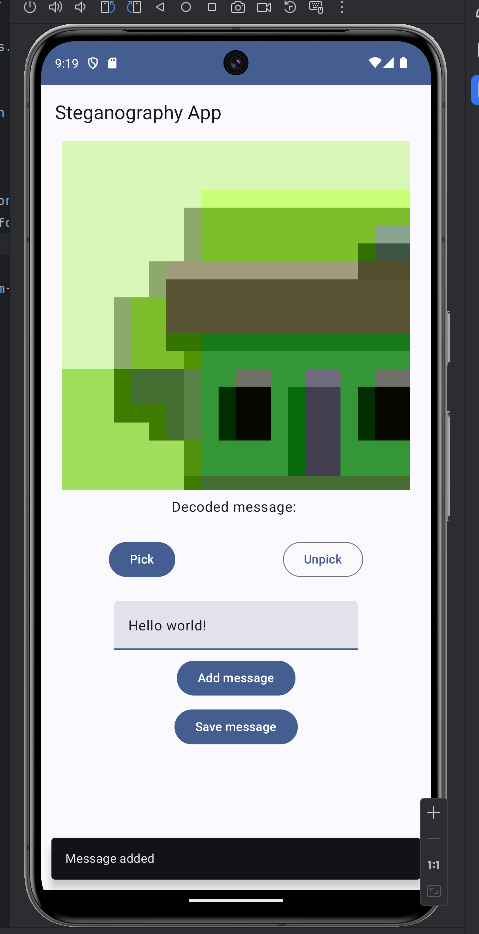
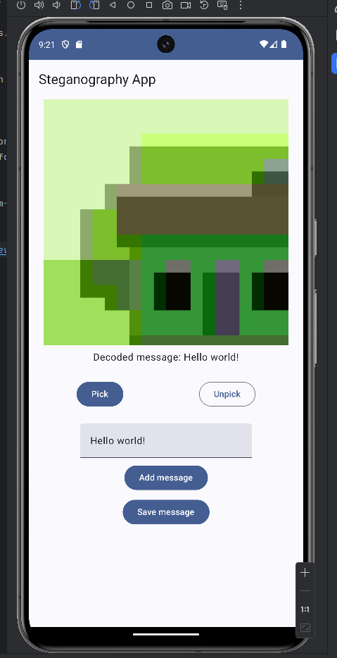

# Steganography-App

Steganography-App is a Kotlin Multiplatform Mobile (KMM) (for now only on Android) application that enables users to hide and read messages within JPEG or PNG image files using steganography techniques combined with Caesar Cipher encryption.

## Installation

Download [apk](https://github.com/matiz22/Steganography-App/releases) from releases. \
For ios maybe in the future (when will be finished) in the 3rd party store :).

## Screenshots

